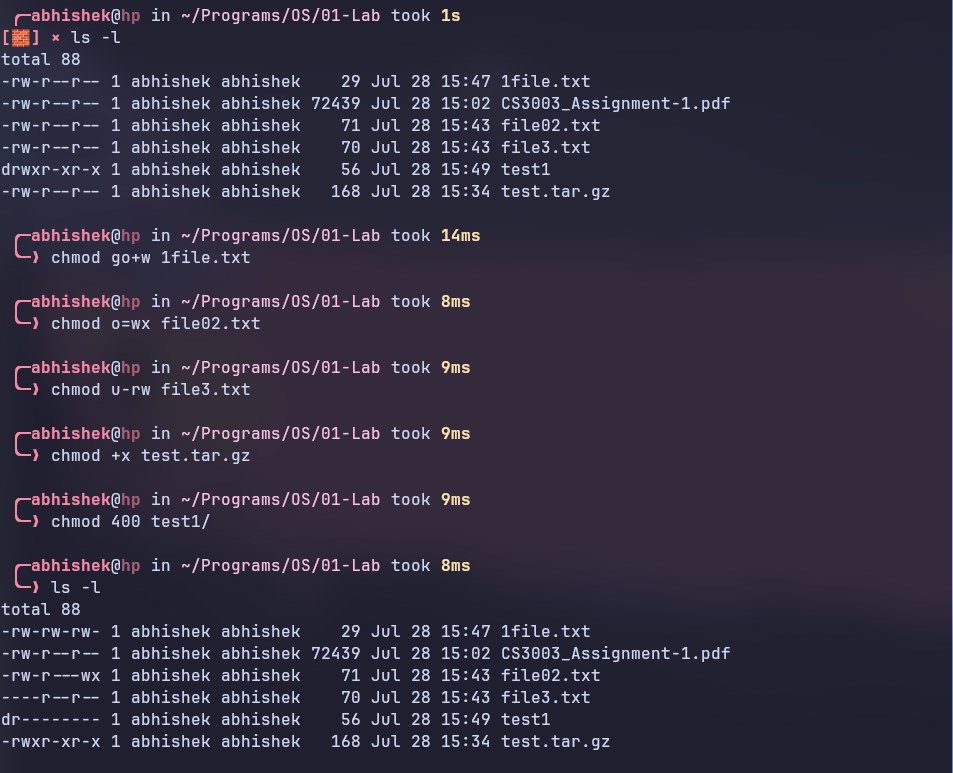
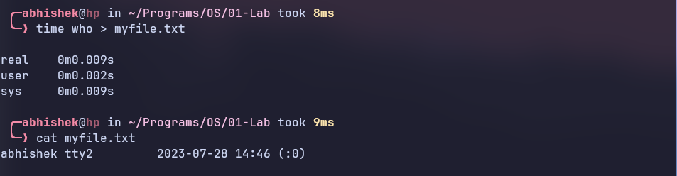

# Lab01

**Name:** Abhishek M J

**Roll No:** CS21B2018

## 1. Listing contents in a directory

- **ls:** List files and directories in the current directory.
- **ls -l:** List files and directories in long format, including permissions, owner, group, size, and modification time.
    

## 2. Reading files

- **cat:** Print the contents of a file to the screen.
- **more:** Display the contents of a file one page at a time.
- **less:** Display the contents of a file one page at a time, with the ability to move forward and backward in the file.
    
    

## 3. Manipulating files

- **touch:** Create an empty file with the specified name or update the timestamp of an existing file.
- **cp:** Copy files or directories from one location to another.
- **cp -R:** Recursively copy directories and their contents from one location to another.
- **rm:** Remove (delete) files or directories permanently.
- **mkdir:** Create a new directory with the specified name.
    

## 4. Other common commands

- **tar:** Archive files together into a single file (tape archive) or extract files from a tar archive.
- **tar czvf:** Create a new tar archive (`c`), compress it using gzip (`z`), verbosely list the files being processed during archiving (`v`), and specify the filename of the new archive (`f`).
- **tar xvf:** Extract files from a tar archive (`x`), verbosely list the files being processed during extraction (`v`), and specify the filename of the archive to extract from (`f`).
    

- **ssh:** Securely connect to a remote server using the SSH (Secure Shell) protocol for encrypted communication.
- **ssh -p \<port> \<username>@\<address> -i \<keyfile.pem>:** Securely connect to a remote server at the specified \<address> using the SSH (Secure Shell) protocol, with the \<username> and the private key from the \<keyfile.pem> for authentication, and optionally specifying a custom port number with `-p`.
    

- **diff:** Compare and display the differences between two files line by line.
    

- **sort:** Sort lines of text in ascending order and display the result.
- **sort --numeric-sort:** Sort lines of text in ascending order numerically (as numbers) rather than lexicographically (as strings).
    

- **pwd:** Print the working directory, i.e., the current directory that you are in.
    

- **gzip:** Compress files using the gzip compression algorithm, creating a new file with a `.gz` extension.
- **gzip -d:** Decompress files that were compressed using gzip, restoring them to their original form.
    

- **ps:** Display a snapshot of the current processes running on the system.
- **ps aux:** Display detailed information about all processes running on the system, including the ones from all users.
    

- **free:** Display the amount of free and used memory (RAM) on the system, including buffers and cache.
- **free -g|m|h:** Display the amount of free and used memory (RAM) on the system, with the memory sizes shown in gigabytes (`-g`), megabytes (`-m`), or human-readable format (`-h`).
    

- **kill:** Terminate a process or send a signal to a process, allowing you to control its behavior or stop it.
    

## 5. Changing Permissions

- **chmod:** Change the permissions of a file or directory.
- **chmod go+w:** Set write permission for the group and others on a file or directory.
- **chmod o=wx:** Set execute (search) permission for others on a file or directory, and remove write permission for others.
- **chmod u-rw:** Remove read and write permissions for the owner of a file or directory.
- **chmod +x:** Add execute (search) permission for the owner, group, and others on a file or directory.
    

## 6. Some more example commands

### a. `time` and `who` commands

- **time who > myfile.txt:** Run the `who` command to display the currently logged-in users, measure the execution time of the command, and redirect the output to the file `myfile.txt`.
    

### b. Other process management commands

- **top:** Display a real-time dynamic view of the processes running on the system, including their resource usage and other system information.
    

- **pgrep:** List the process IDs (PIDs) of processes that match the specified criteria (process name or other attributes).
- **pkill:** Terminate or signal processes based on their names or other attributes. It sends a signal to processes that match the specified criteria, effectively terminating them or controlling their behavior.
    

